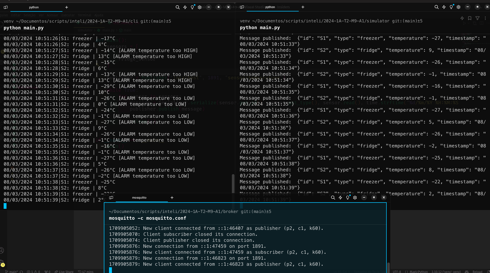

# Temperature monitoring system

Folders:

-   `broker`: MQTT broker (Mosquitto) configuration files
-   `cli`: Command line interface for the temperature monitoring system, showing the temperature from MQTT broker
-   `simulator`: Script to publish temperature data to MQTT broker simulating a temperature sensor

On the `cli` and `simulator` folder, you can find all the tests files of each module.

## How to run

Assuming you have python3 installed, you can create a virtual environment with the following command:

```
python3 -m venv venv
```

Then, you can activate the virtual environment:

```
source venv/bin/activate
```

After that, you can install the requirements:

```
pip install -r requirements.txt
```

### Running all the modules

Now, to run the MQTT broker, using mosquitto, you can run the following command on folder `broker´

```
mosquitto -c broker/mosquitto.conf
```

Then, you can run the simulator to publish temperature data to the MQTT broker:

```
python simulator/main.py
```

Finally, you can run the command line interface to show the temperature data from the MQTT broker:

```
python cli/main.py
```

## Demo image:


